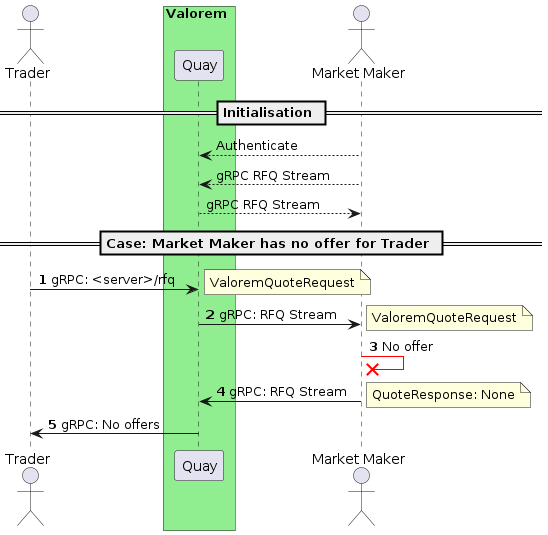
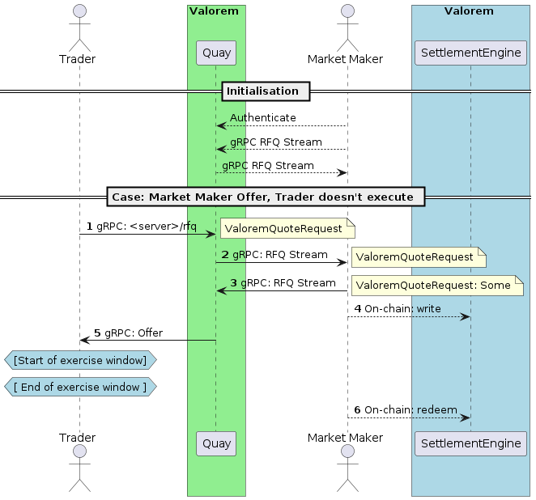
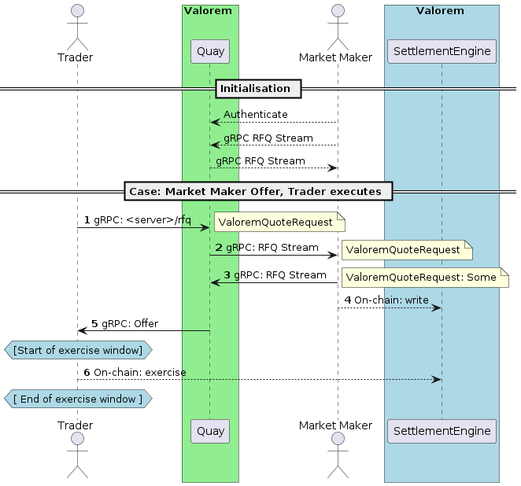
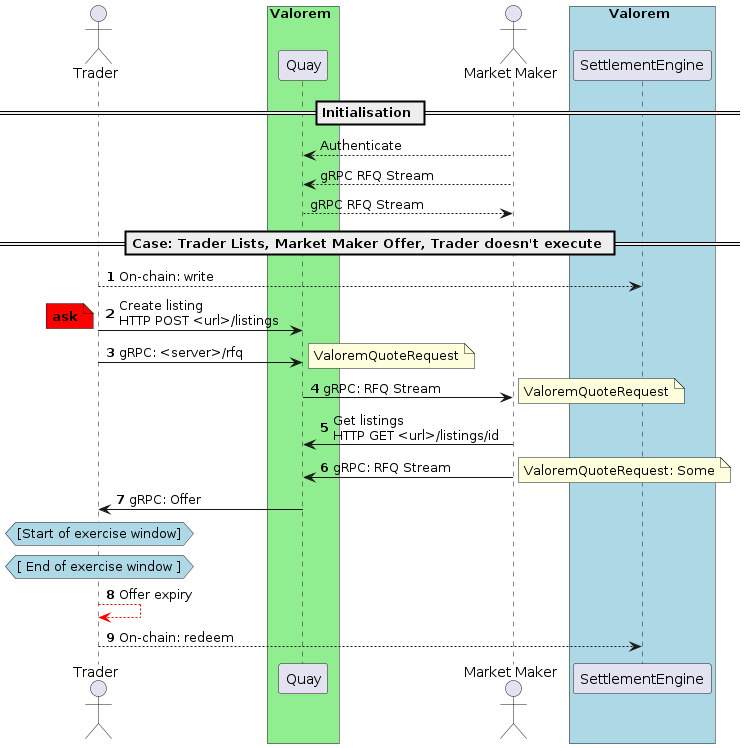
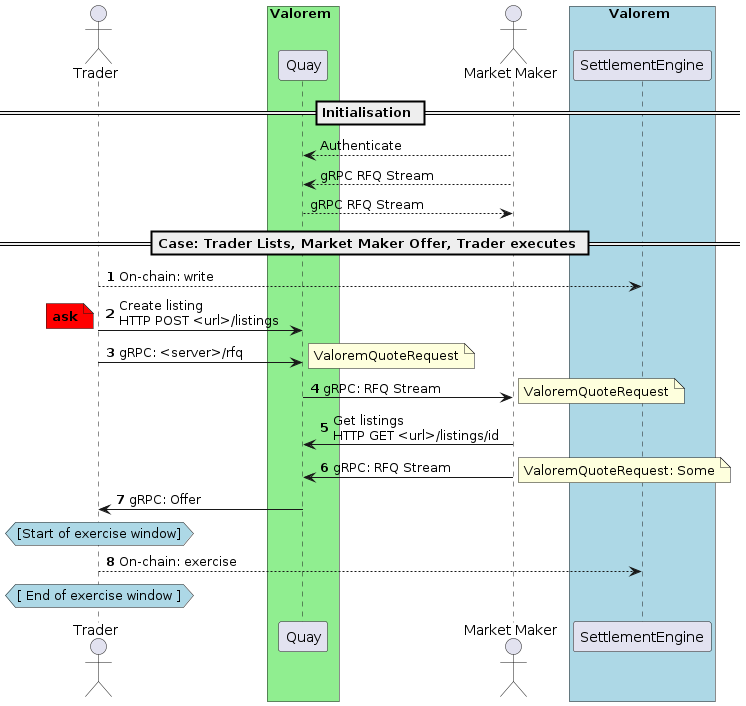

# Sequence Diagrams
### The market maker does not give an offer:


### The market maker gives an offer, trader does not execute:
The Market Maker may interact directly with a wallet or contract.



### The market maker gives an offer, trader executes offer:
The Market Maker may interact directly with a wallet or contract.



### Trader creates a listing for market maker offer, trader does not execute:
Trader may want to sell their (created) options to the market maker instead.



### Trader creates a listing for market maker offer, trader executes:
Trader may want to sell their (created) options to the market maker instead.



### General
#### Request for Quote (RFQ) data structure

If the Trader doesn't fill the `exerciseTimestamp` or `expiryTimestamp`
then the Market Maker is free to set those values to whatever it chooses
on the Option, otherwise the Market Maker must have the values set to 
what the Trader wishes if it makes an offer.

If the `listingId` is `Some` then all the information is taken from
the listing instead.

The Request for Quote request structure:

```protobuf
message ValoremQuoteRequest {
  required H160 traderAddress = 1;
  required H160 underlyingAsset = 2;
  optional H96 underlyingAmount = 3;
  required H160 exerciseAsset = 4;
  required H96 exerciseAmount = 5;
  optional H40 exerciseTimestamp = 6;
  optional H40 expiryTimestamp = 7;
  optional U256 listingId = 8;
}
```

#### Quote Response data structure

If the Market Maker doesn't create an order, then the `order` field in the
response will be `None`. If the Market Maker has an order and the response
will contain `Some(order)`.

Quote response
structure:

```protobuf
message QuoteResponse {
  optional Order order = 1;
}
```
