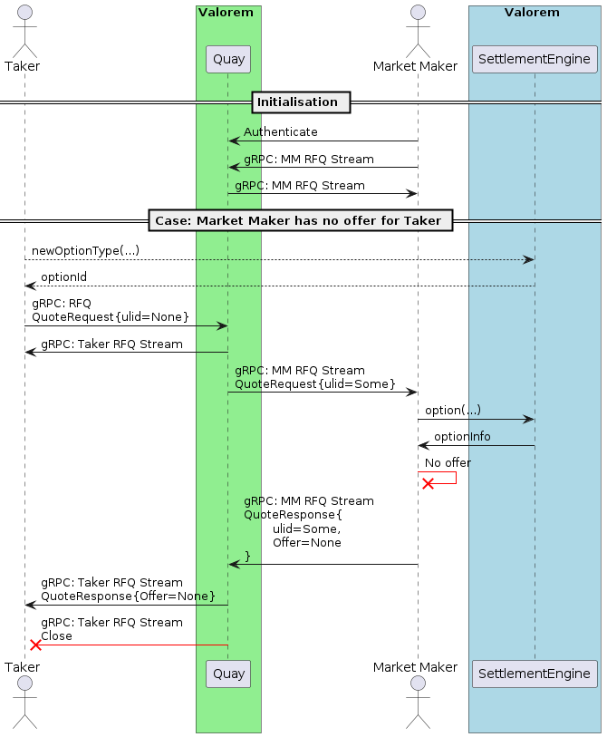
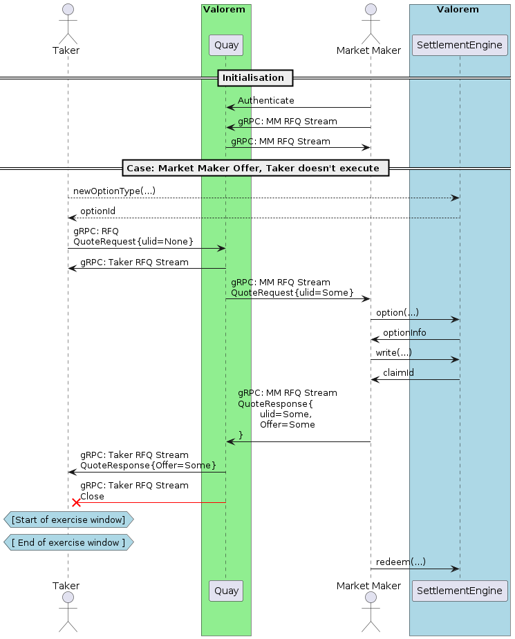

# Sequence Diagrams
### The market maker does not give an offer:
The following diagram assumes that the Options token does not currently exist. However, if the Option does exist,
then the Trader can forgo the request to `newOptionType` and instead simply just use the Option ID.

The diagram highlights important fields within the messages being passed. The message structure with theses fields
may not contain _all_ required fields



### The market maker gives an offer, trader does not execute:
The following diagram assumes that the Options token does not currently exist. However, if the Option does exist,
then the Trader can forgo the request to `newOptionType` and instead simply just use the Option ID.

The diagram highlights important fields within the messages being passed. The message structure with theses fields
may not contain _all_ required fields



### The market maker gives an offer, trader executes offer:
The following diagram assumes that the Options token does not currently exist. However, if the Option does exist,
then the Trader can forgo the request to `newOptionType` and instead simply just use the Option ID.

The diagram highlights important fields within the messages being passed. The message structure with theses fields
may not contain _all_ required fields


### General
#### Request for Quote (RFQ) data structure

If the Trader doesn't fill the `exerciseTimestamp` or `expiryTimestamp`
then the Market Maker is free to set those values to whatever it chooses
on the Option, otherwise the Market Maker must have the values set to
what the Trader wishes if it makes an offer.

If the `listingId` is `Some` then all the information is taken from
the listing instead.

The Request for Quote request structure:

```protobuf
message QuoteRequest {
  optional H128 ulid = 1;
  optional H160 takerAddress = 2;
  ItemType itemType = 3;
  optional H160 tokenAddress = 4;
  optional H256 identifierOrCriteria = 5;
  H256 startAmount = 6;
  H256 endAmount = 7;
  Action action = 8;
}
```

#### Quote Response data structure

If the Market Maker doesn't create an order, then the `order` field in the
response will be `None`. If the Market Maker has an order and the response
will contain `Some(order)`.

Quote response
structure:

```protobuf
message QuoteResponse {
  optional H128 ulid = 1;
  optional H160 makerAddress = 2;
  Order order = 3;
}
```
