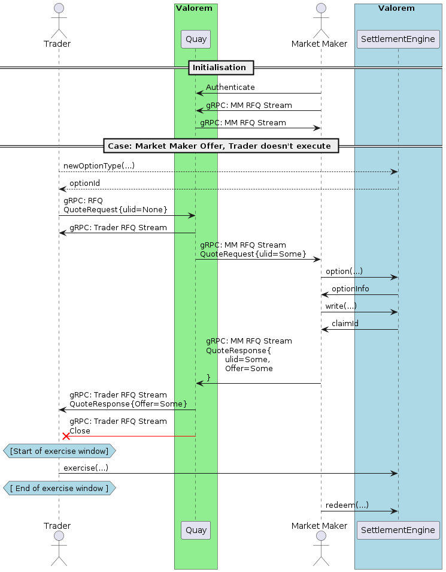

# Sequence Diagrams
### The market maker does not give an offer:


### The market maker gives an offer, trader does not execute:
The Market Maker may interact directly with a wallet or contract.


### The market maker gives an offer, trader executes offer:
The Market Maker may interact directly with a wallet or contract.



### Trader creates a listing for market maker offer, trader does not execute:
Trader may want to sell their (created) options to the market maker instead.


### Trader creates a listing for market maker offer, trader executes:
Trader may want to sell their (created) options to the market maker instead.


### Market Maker General Pricing:
This sequence allows the front end to display the general pricing for assets before
requesting for a quote.


### General
#### Request for Quote (RFQ) JSON data structure
If the `listingId` is given then all other details will be ignored.

```json
{
  "listingId": 0,
  "traderAddress": "",
  "underlyingAsset": "",
  "underlyingAmount": 0,
  "exerciseAsset": "",
  "exerciseAmount": 0,
  "exerciseTimestamp": 0,
  "expiryTimestamp": 0,
  "settlementSeed": 0,
  "nextClaimNum": 0
}
```

#### Reply JSON data structure
`messageId` and `traderAddress` would just echo back the details in the
RFQ message.

If an offer was made:
```json
{
  "traderAddress": "",
  "messageId": 0,
  "hasOffer": true
}

```

If an offer was not made:
```json
{
  "traderAddress": "",
  "messageId": 0,
  "hasOffer": false
}
```